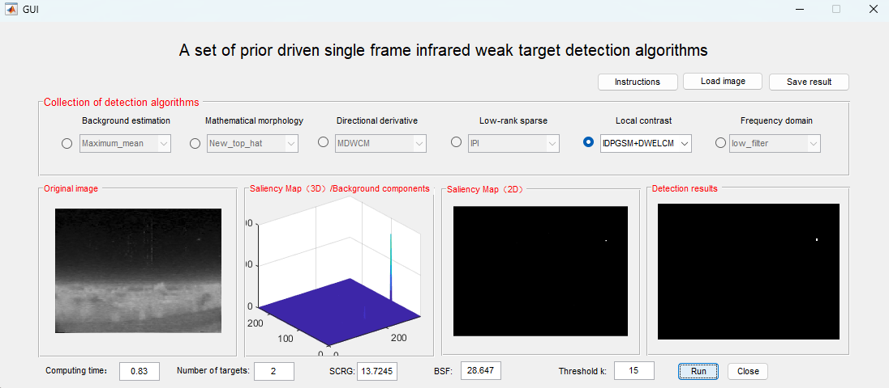

## 红外小目标检测可视化系统

一个开源的红外小目标检测可视化系统，集成了模型驱动和数据驱动两种方法，为研究者提供完整的算法验证和性能评估平台。

📋 项目简介
本项目包含两个独立的红外小目标检测系统：

🔧 模型驱动系统 (MATLAB)

- 基于经典图像处理算法的红外小目标检测

- 收录了多种经典检测算法

- 提供算法对比分析和可视化界面

- 支持研究者扩展和补充新算法

🤖 数据驱动系统 (Python)

- 基于深度学习的红外小目标分割

- 支持模型评估和性能分析

- 提供单帧图像推理、离线视频推理和在线实时推理

- 模块化设计，易于模型扩展和替换

- 具体使用请参考(https://github.com/kourenke/LW-IRSTNet/tree/main/IRSTD_streamlit)
